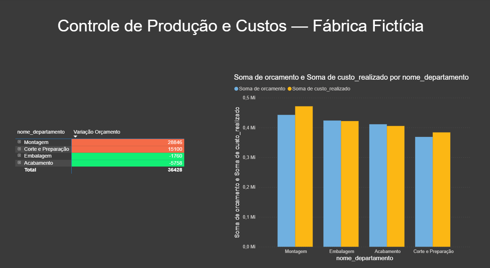
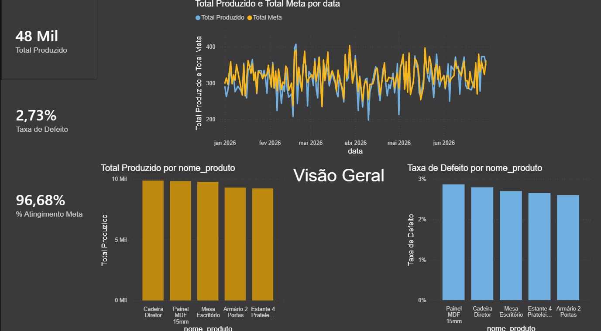

# 📊 Controle de Produção e Custos Industrial — Power BI

Dashboard desenvolvido para simular um cenário real de **Analista de
Dados/BI** no setor industrial — área com forte presença na região de
Bauru/SP (móveis, alimentos, manufatura) — cobrindo indicadores de
produção, qualidade e controle orçamentário por departamento.

## 🎯 Sobre este projeto

Este projeto faz parte da minha transição de carreira para a área de
Análise de Dados / Business Intelligence. Ele simula as perguntas de
negócio que um Analista de Planejamento/Controle de Custos precisa
responder no dia a dia de uma indústria:

- A fábrica está batendo a meta de produção?
- Qual produto tem maior taxa de defeito, e precisa de atenção?
- Os departamentos estão dentro do orçamento previsto, ou estourando?
- Existe alguma tendência visível na produção ao longo do tempo?

Os dados são **fictícios**, gerados especificamente para este projeto —
não representam nenhuma empresa real.

## 🖼️ Prévia do dashboard

### Página 1 — Visão Geral de Produção


### Página 2 — Custos por Departamento


*(Substituir pelos prints reais das duas páginas antes de subir ao GitHub)*

## 🗂️ Estrutura dos dados

O projeto segue o **modelo estrela** (star schema), padrão usado em
ferramentas de BI para otimizar performance e organização:

```
dim_departamentos ──┐
                     ├── dim_linhas_producao ── dim_produtos ── fato_producao
                     └── fato_custos
```

- **dim_departamentos**: os 4 setores da fábrica (Corte e Preparação, Montagem, Acabamento, Embalagem)
- **dim_linhas_producao**: as 3 linhas de produção
- **dim_produtos**: os 5 produtos fabricados
- **fato_producao**: 775 registros — produção diária por produto (Jan–Jun/2026), com meta, quantidade produzida e quantidade defeituosa
- **fato_custos**: 24 registros — orçamento vs. custo realizado por departamento e mês

## 🧮 Medidas DAX criadas

| Medida | Fórmula | O que mede |
|---|---|---|
| Total Produzido | `SUM(fato_producao[qtd_produzida])` | Volume total produzido |
| Total Meta | `SUM(fato_producao[meta_producao])` | Meta total estabelecida |
| % Atingimento Meta | `DIVIDE([Total Produzido], [Total Meta], 0)` | Percentual da meta atingido |
| Taxa de Defeito | `DIVIDE(SUM(qtd_defeituosa), [Total Produzido], 0)` | Percentual de itens defeituosos |
| Variação Orçamento | `SUM(custo_realizado) - SUM(orcamento)` | Estouro (+) ou economia (-) por departamento |

## 📈 Decisões de design do dashboard

- **Formatação condicional** na matriz de custos: vermelho para
  departamentos que estouraram o orçamento, verde para os que ficaram
  dentro do previsto — permite identificar o problema em segundos,
  sem precisar ler número por número
- **Cartões de KPI** no topo da página de produção, priorizando os
  números mais importantes antes dos gráficos de detalhe — pensado
  para uma apresentação rápida de resultados em reunião
- **Gráfico de linha comparando produção real vs. meta**, permitindo
  identificar tendências e dias fora do padrão ao longo do semestre

## 🛠️ Tecnologias utilizadas

- Power BI Desktop (modelagem de dados, DAX, visualização)
- SQL (estrutura relacional e carga dos dados — script disponível em [`industria_producao_custos.sql`](industria_producao_custos.sql))
- Excel (fonte de dados alternativa — [`industria_producao_custos.xlsx`](industria_producao_custos.xlsx))

## 📁 Arquivos deste repositório

| Arquivo | Descrição |
|---|---|
| `dashboard_producao_custos.pbix` | Arquivo do Power BI, pronto para abrir |
| `industria_producao_custos.sql` | Script SQL completo (estrutura + dados) |
| `industria_producao_custos.xlsx` | Mesmos dados em Excel |
| `industria.db` | Banco SQLite para testes rápidos de consulta |

## 🚀 Como visualizar

1. Baixe o [Power BI Desktop](https://powerbi.microsoft.com/desktop/) (gratuito)
2. Abra o arquivo `dashboard_producao_custos.pbix`
3. Os dados já estão embutidos no arquivo — não é necessário reconectar a nenhuma fonte externa

## 👨‍💻 Sobre mim

Estou em transição de carreira para Análise de Dados / Business
Intelligence, unindo formação em Tecnologia da Informação a mais de 10
anos de experiência em gestão de processos, indicadores operacionais e
conformidade regulatória. Este projeto reflete tanto o domínio técnico
das ferramentas quanto a familiaridade prática com o tipo de decisão
que esses indicadores apoiam no dia a dia de uma empresa.

📎 [LinkedIn](https://br.linkedin.com/in/marcos-rogerio-botelho-pavani-0015271a)
📎 [GitHub](https://github.com/Roarealva)
